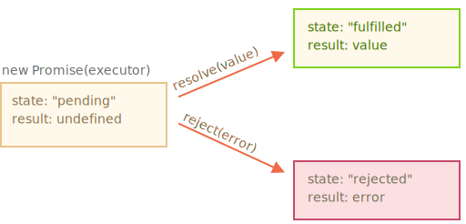

## AJAX

AJAX (аббревиатура от «Asynchronous Javascript And Xml») – технология обращения к серверу без перезагрузки страницы.

Под AJAX подразумевают любое общение с сервером без перезагрузки страницы, организованное при помощи JavaScript.

Примеры:
- отправка данных с формы
- живой поиск
- подгрузка информации по взаимодействию пользователя с UI

Используются форматы:

- JSON 
- XML
- HTML/текст 
- Бинарные данные, файлы

## HTTP запросы

*GET* запрашивает представление ресурса. Запросы с использованием этого метода могут только извлекать данные.

*POST* используется для отправки сущностей к определённому ресурсу. Часто вызывает изменение состояния 
или какие-то побочные эффекты на сервере.

*DELETE* удаляет указанный ресурс.

*PUT* заменяет все текущие представления ресурса данными запроса.
 
*PATCH* используется для частичного изменения ресурса.


## XMLHttpRequest

Объект XMLHttpRequest дает возможность из JavaScript делать HTTP-запросы к серверу без перезагрузки страницы.

```javascript
let xhr = new XMLHttpRequest();

xhr.open("GET", "https://www.googleapis.com/books/v1/volumes", false); // Конфигурируем его: GET-запрос на URL "https://www.googleapis.com/books/v1/volumes"

xhr.send(); // Отсылаем запрос

if (xhr.status != 200) { // обработать ошибку
  alert( xhr.status + ': ' + xhr.statusText ); // вывод ошибки
} else { // вывести результат
  alert( xhr.responseText ); // responseText -- текст ответа.
}
```

xhr.open(method, URL, async, user, password) - настроить запрос;

xhr.send(body) - отсылаем запрос с данными;

xhr.abort() - прерываем запрос;

Основные полезные свойства ответа:

- status - код статуса запроса(200, 400, 403);
- statusText - текстовое описание статуса ответа;
- responseText - текст ответа сервера;

## Promise

Promise помогает удобно организовать асинхронный код.

Promise – это специальный объект, который содержит своё состояние. Вначале pending («ожидание»), 
затем – одно из: fulfilled («выполнено успешно») или rejected («выполнено с ошибкой»).



На promise можно навешивать колл-беки на успех или ошибку.

```javascript
let promise = new Promise(function(resolve, reject) {
  // Эта функция будет вызвана автоматически

  // В ней можно делать любые асинхронные операции,
  // А когда они завершатся — нужно вызвать одно из:
  // resolve(результат) при успешном выполнении
  // reject(ошибка) при ошибке
})
```

Универсальный метод для навешивания обработчиков:

promise.then(onFulfilled, onRejected);

- onFulfilled – функция, которая будет вызвана с результатом при resolve.
- onRejected – функция, которая будет вызвана с ошибкой при reject.

### Промисификация 
*Промисификация* – это когда берут асинхронный функционал и делают для него обёртку, возвращающую промис.

После промисификации использование функционала зачастую становится гораздо удобнее.
    
```javascript
function httpGet(url) {
    return new Promise(function(resolve, reject) {
        var xhr = new XMLHttpRequest();
        xhr.open('GET', url, true);

        xhr.onload = function() {
            if (this.status == 200) {
                resolve(this.response);
            } else {
                var error = new Error(this.statusText);
                error.code = this.status;
                reject(error);
            }
        };
        xhr.send();
  	});
}

httpGet("https://trevadim.github.io/vue/data/data.json")
  	.then(
  	    response => alert(`Fulfilled: ${response}`),
    	error => alert(`Rejected: ${error}`)
);
```

## «Чейнинг» (chaining)

Это возможность строить асинхронные цепочки из промисов – пожалуй, основная причина, 
из-за которой существуют и активно используются промисы.

```javascript
httpGet(...)
  	.then(response => {
        return response.user;
    })
  	.then(user => {
		return getFullInfo(user.id);
    })
    .then(info => {
	    alert(info);
    })
    .catch(error => {
	    alert(error);
    );
```

## Метод fetch: замена XMLHttpRequest

Метод fetch – это XMLHttpRequest нового поколения. Он предоставляет улучшенный интерфейс для осуществления запросов к серверу: 
как по части возможностей и контроля над происходящим, так и по синтаксису, так как построен на промисах.

Синтаксис:
	fetch(url, options);
	
При вызове fetch возвращает промис, который, когда получен ответ, выполняет коллбэки с объектом Response или с ошибкой, если запрос не удался.

### Материалы для прочтения 

- Основы XmlHttpRequest https://learn.javascript.ru/xmlhttprequest
- Promise https://learn.javascript.ru/promise-basics
- Fetch https://learn.javascript.ru/fetch
