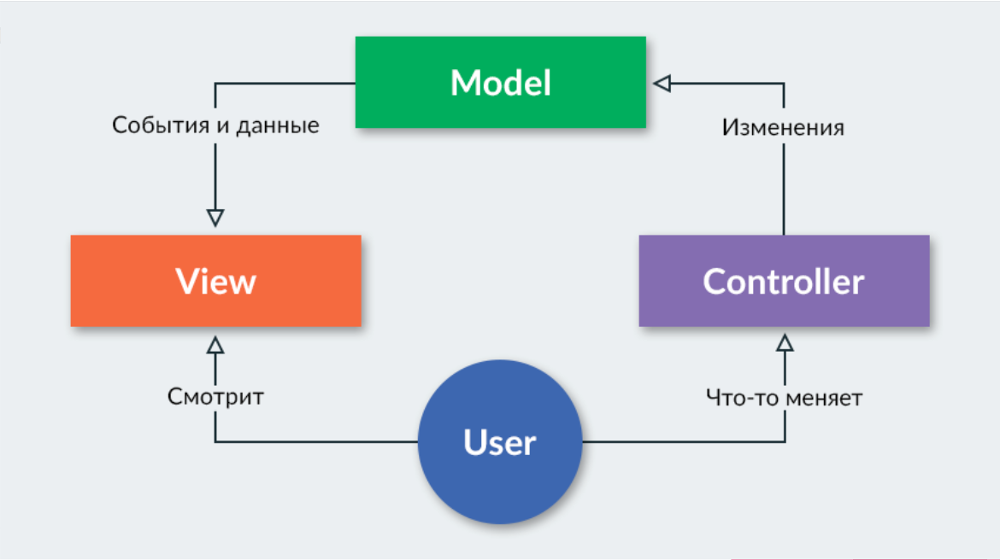

## TypeScript

https://www.typescriptlang.org/

### Предпосылки

В далёком 2012 году компания Microsoft выпустила первую публичную версию TypeScript, создателем которого является Андерс Хейлсберг.

С появлением Node.js и, позднее Electron, мир JavaScript заставил разработчиков взглянуть на себя по новому, что, как следствие, привело «больших» игроков на это поле.

Так что же привело к созданию TypeScript? – желание программистов меньше думать и быть уверенными в завтрашнем дне, а если честно, то:
- Сам по себе JavaScript не модульный. В то время ES2015 Modules лишь были в планах, а require – это задумка Node.js, не являющаяся стандартом.
- Иногда JavaScript ведёт себя непредсказуемо, что определяется динамической типизацией.
- Большое количество способов выстрелить себе в ногу, если не думать о завтрашнем дне.

*TypeScript* — язык программирования, представленный Microsoft в 2012 году и позиционируемый как средство разработки веб-приложений, расширяющее возможности JavaScript.

Плюсы TypeScript:
- Поддержка многими популярными IDE
- TypeScript — строго типизированный (опционально!) и компилируемый в JavaScript язык. 
- TypeScript реализует многие концепции ООП, такие как наследование, полиморфизм, инкапсуляция и модификаторы доступа. В нем есть классы, интерфейсы и (даже!) абстрактные классы.
- Потенциал языка позволяет быстрее и проще писать сложные комплексные решения, которые легче развивать и тестировать в дальнейшем, чем на стандартном JavaScript.
- TypeScript — надмножество JavaScript, поэтому любой код на JavaScript будет выполнен и в TypeScript. 


### Немного о статической типизации

Статическая типизация отличается от динамической тем, что в первом случае проверка типов осуществляется во время компиляции, а во втором – во время выполнения инструкций.

```javascript
// JS код
function sum(a, b) {
  return a + b;
}

sum(2, 3); // 5
sum(2, "3"); // "23"

// Typescript
function sum(a: number, b: number): number {
  return a + b;
}

sum(2, 3);   // Ok
sum(2, "3"); // Error!
```

Уже на этапе компиляции мы можем обнаружить ошибку. Тратить силы лучше на разработку, а не на поиск ошибки и написания дополнительных тестов.

## Фреймверки

Фреймворк — заготовки, шаблоны для программной платформы, определяющие архитектуру программной системы; программное обеспечение,
облегчающее разработку и объединение разных модулей программного проекта.

Одностраничное приложение (SPA) — это веб-приложение или веб-сайт, использующий единственный HTML-документ как оболочку для 
всех веб-страниц и организующий взаимодействие с пользователем через динамически подгружаемые HTML, CSS, JavaScript, обычно посредством AJAX.

## Model-View-Controller



Основная цель применения этой концепции состоит в отделении бизнес-логики (модели) от её визуализации (представления, вида). 
За счет такого разделения повышается возможность повторного использования кода. Наиболее полезно применение данной концепции 
в тех случаях, когда пользователь должен видеть те же самые данные одновременно в различных контекстах и/или с различных точек зрения. 
В частности, выполняются следующие задачи:
- К одной модели можно присоединить несколько видов, при этом не затрагивая реализацию модели. Например, некоторые данные могут 
быть одновременно представлены в виде электронной таблицы, гистограммы и круговой диаграммы;
- Не затрагивая реализацию видов, можно изменить реакции на действия пользователя (нажатие мышью на кнопке, ввод данных) — 
для этого достаточно использовать другой контроллер;

## AngularJS и….. Angular 2+ от Google

AngularJS разработан в 2009 году.

Его цель — расширение браузерных приложений на основе MVC-шаблона, а также упрощение тестирования и разработки.

Фреймворк работает с HTML, содержащим дополнительные пользовательские атрибуты, которые описываются директивами, и связывает 
ввод или вывод области страницы с моделью, представляющей собой обычные переменные JavaScript. Значения этих переменных 
задаются вручную или извлекаются из статических или динамических JSON-данных.

В марте 2014 было объявлено о начале разработки AngularJS 2.0. Новая версия писалась с нуля на TypeScript и очень сильно 
отличалась от предыдущей, поэтому было решено развивать её как отдельный фреймворк с названием Angular. Angular 2 был выпущен 
15 сентября 2016 года, тогда как первая версия продолжила развиваться отдельно как AngularJS.

Фреймворк адаптирует и расширяет традиционный HTML, чтобы обеспечить двустороннюю привязку данных для динамического контента, 
что позволяет автоматически синхронизировать модель и представление. В результате AngularJS уменьшает роль DOM-манипуляций 
и улучшает тестируемость.

Angular придерживается MVC-шаблона проектирования и поощряет слабую связь между представлением, данными и логикой компонентов.

Двустороннее связывание данных в AngularJS является наиболее примечательной особенностью, и уменьшает количество кода, освобождая 
сервер от работы с шаблонами. Вместо этого, шаблоны отображаются как обычный HTML, наполненный данными, содержащимися в области 
видимости, определенной в модели. Сервис $scope в Angular следит за изменениями в модели и изменяет раздел HTML-выражения в 
представлении через контроллер. Кроме того, любые изменения в представлении отражаются в модели. Это позволяет обойти необходимость 
манипулирования DOM и облегчает инициализацию и прототипирование веб-приложений

## Angular 2+

Angular позволяет вам из "коробки" создавать большие и сложные по части бизнес-логики приложения. Angular было полным переосмыслением 
AngularJS, наверное, это было самое болезненное, но оно того стоило, сам фреймворк стал куда чище и гибче, более enterprise-подобным 
и с этой точки зрения обладает высокой масштабируемостью.

Какие плюсы можно выделить:
- Поддержка Google, Microsoft;
- Инструменты разработчика (CLI);
- Единая структура проекта;
- TypeScript из "коробки" (вы можете писать строго типизированный код);
- Шаблоны, основанные на расширении HTML;
- Кросс-браузерный Shadow DOM из коробки (либо его эмуляция);

## React от Facebook

React — это эффективная и гибкая библиотека JavaScript для сборки UI от команды Facebook. Она позволяет без усилий создавать 
интерактивный пользовательский интерфейс. 

Особенности:
- Однонаправленная передача данных
- Виртуальный DOM.
- JSX.
- Методы жизненного цикла.
- Возможность легко расширять и дополнять ваше приложение сторонними библиотеками.
- Гибкий в построении и моделировании приложения.
- Большое комьюнити.

## Vue от Эван Ю

Vue (произносится /vjuː/, примерно как view) — это прогрессивный фреймворк для создания пользовательских интерфейсов. 
В отличие от фреймворков-монолитов, Vue создан пригодным для постепенного внедрения. Его ядро в первую очередь решает задачи 
уровня представления (view), что упрощает интеграцию с другими библиотеками и существующими проектами. С другой стороны, 
Vue полностью подходит и для создания сложных одно-страничных приложений (SPA, Single-Page Applications), если использовать 
его совместно с современными инструментами и дополнительными библиотеками.

Главная особенность: Он взял лучшее от React и Angular.

Проблема с типизацией, но с выходом 3й версии перейдут на TypeScript.

## Что выбрать?
