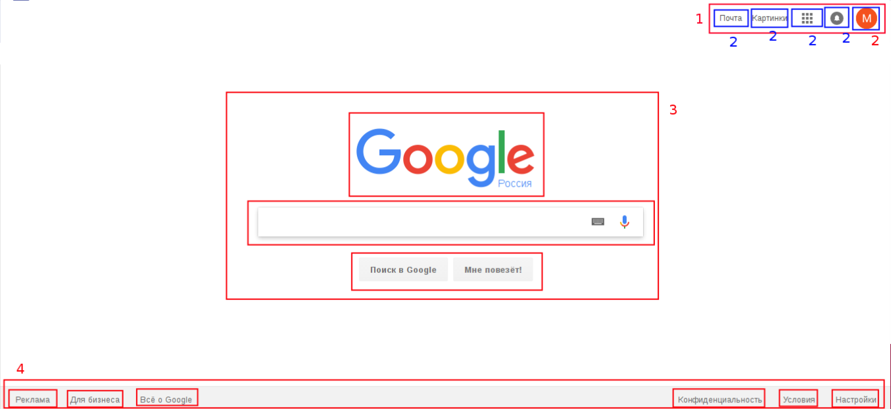
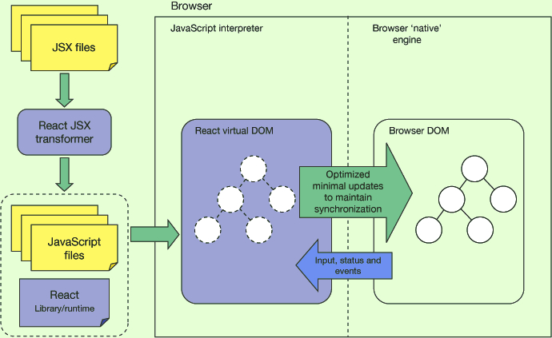

## React


*React* - это JavaScript библиотека c открытым исходным кодом для создания пользовательских интерфейсов. Его главная 
задача — обеспечение вывода на экран того, что можно видеть на веб-страницах. React значительно облегчает создание интерфейсов 
благодаря разбиению каждой страницы на небольшие фрагменты. Библиотека React была впервые выпущена компанией Facebook в 
2013 году. На сегодняшний день эта библиотека стала одной из самых любимых и востребованных технологий, а также самой трендовой 
технологией на StackOverflow.



Чем же React отличается от других инструментов для создания пользовательских интерфейсов? Давайте рассмотрим несколько плюсов 
и минусов.

Плюсы:

- Вы всегда можете сказать, как ваш компонент будет отрисован, глядя на исходный код. (Это может быть важным преимуществом, 
хотя это ничем не отличается от шаблонов Angular.)
- Связывание JavaScript и HTML в JSX делает компоненты простыми для понимания. Странное сочетание HTML/JavaScript может ваc
смутить. Но как только вы столкнетесь с JSX это вам понравится.
- Вы можете рендерить React на сервере. (Опять же ангулярщики скажут «мы тоже так можем», но официально в этот Фреймворк эта фича 
была добавлена только в 4-й версии, а в React это фича была изначально)
- Virtual DOM
- Благодаря переиспользованию кода стало гораздо проще создавать мобильные приложения. Код, который был написан во время 
создания сайта, может быть снова использован для создания мобильного приложения. Если вы планируете использовать не только сайт, 
но и мобильное приложение, нет необходимости нанимать две большие команды разработчиков.

Минусы: Не забывайте, что React — это только представление. Вы не получите:

1. Встроенную работу с AJAX;
2. Какой либо слой данных;
3. Готовый роутинг;
4. Фреймворк на все случаи жизни;

### Virtual DOM

*Что такое DOM?*
DOM (аббревиатура от Document Object Model) — способ представления структурного документа с помощью объектов. Это кроссплатформенное 
и языко-независимое соглашение для представления и взаимодействия с данными в HTML, XML и т.д.

*Проблема DOM*
Главная проблема DOM — он никогда не был рассчитан для создания динамического пользовательского интерфейса (UI). 
Мы можем работать с ним, используя JavaScript и библиотеки наподобие jQuery, но их использование не решает проблем с 
производительностью. Посмотрите на современные социальные сети, такие как Twitter, Facebook или Pinterest. После небольшого 
скроллинга, мы будем иметь десятки тысяч DOM-узлов, эффективно взаимодействовать с которыми — задача не из легких.
Для примера, попробуйте переместить 1000 div-блоков на 5 пикселей влево. Это может занять больше секунды — это слишком 
много для современного интернета. Вы можете оптимизировать скрипт и использовать некоторые приемы, но в итоге это вызовет 
лишь головную боль при работе с огромными страницами и динамическим UI.

*Решение Virtual DOM*
Вместо того, чтобы взаимодействовать с DOM напрямую, мы работаем с его легковесной копией. Мы можем вносить изменения в копию, 
исходя из наших потребностей, а после этого применять изменения к реальному DOM. При этом происходит сравнение DOM-дерева 
с его виртуальной копией, определяется разница и запускается перерисовка того, что было изменено. Такой подход работает быстрее, 
потому как не включает в себя все тяжеловесные части реального DOM.



### Components

Компоненты аналогичны функциям JavaScript. Они хранят состояние с помощью свойств и возвращают элементы React, которые затем 
появляются на веб-странице. Компоненты главная строительная единица "кирпичики" React приложения.Несмотря на то, что многие 
важные концепции должны быть покрыты, компоненты, несомненно, являются сердцем и душой React. Хорошее понимание компонентов 
должно сделать вашу жизнь легкой, как React разработчика.

#### Создание components

Компоненты можно определить различными способами. 
Первый способ - функциональный.
 
Здесь определяется компонент Hello.
```javascript
function Hello() {
  	return <h1>Привет, Student</h1>;
}
```

Второй способ определения компонентов предполагает использование классов ES6:

```javascript
class Hello extends React.Component {
    render() {
        return <h1>Привет, Student</h1>;
    }
}
```

Также для определения мы можем использовать стрелочные функции (arrow functions):

```javascript
const hello = () => {
    return (<h1>Привет, Student</h1>);
}

// or 

const hello = () => <h1>Привет, Student</h1>
```

#### Stateful и Stateless Components

Компоненты в React содержащие внутреннее состояние — *state*, называются **Stateful**. Без него — **Stateless**. 
Многие заблуждаются думая, что **Stateless** компоненты могут быть только в виде *function*. Единственное, что отличает 
**Stateless** от **Stateful** компонентов — это отсутствие внутреннего состояния. В React версии 16 нет разницы используйте 
вы компонент как *class* или как *function*, производительность от этого не изменится (как это было раньше). Пример **Stateless** 
компонентa, которая принимает *props* и не содержат *state*:

```javascript
const Button = props => (
  <button onClick={props.onClick}>{props.text}</button>
)

export default Button;
```

Пример **Stateful** компоненты, где в виде внутреннего состояния выступает *state* содержащий количество кликов:

```javascript
import Button from './components/button'

class ButtonCounter extends React.Component {
    state = { counter: 0 }
    
    handleClick = () => this.setState(prevState => ({ counter: prevState.counter + 1 })
    
    render() {
        return (
            <Button onClick={this.handleClick} text={`You are clicked ${this.state.counter} times`} />
        )
    }
}
```

Вы можете использовать либо функцию, либо класс для создания компонентов без состояния. Но если вам не нужно использовать 
хуки жизненного цикла в ваших компонентах, желательно перейти на функциональные компоненты без состояния. Есть много преимуществ, 
если вы решили использовать функциональные компоненты без *state*: они просты в написании, понимании и тестировании, и вы 
можете вообще избегать ключевого слова *this*.

Недостатком является то, что вы не можете использовать хуки жизненного цикла. Метод жизненного цикла ShouldComponentUpdate() 
часто используется для оптимизации производительности и для ручного управления тем, что получает рендеринг. Вы не можете 
использовать это с функциональными компонентами. **Refs** также не поддерживаются.

### Container и Presentational Components

Это еще один паттерн, который очень полезен при написании компонентов. Преимущество такого подхода заключается в том, что 
логика поведения отделена от презентационной логики.

*Компоненты презенторы* - презентационные компоненты сочетаются с представлением или отвечают за отображение. Эти компоненты 
принимают props из своего контейнера и рендерят их. Все, что связано с описанием пользовательского интерфейса, должно быть здесь. 
Презентационные компоненты могут повторно использоваться и должны оставаться отделенными от поведенческого слоя. Презентационный 
компонент получает данные и коллбеки исключительно через *props*, и когда происходит событие, например нажатие кнопки, он 
вызывает коллбек к компоненту контейнера через *props* для вызова метода обработки событий. Функциональные компоненты должны быть 
вашим первым выбором для написания презентационных компонентов, если не требуется состояние. Если презентационный компонент требует 
состояния, он должен быть связан с состоянием пользовательского интерфейса, а не с фактическими данными. Презентационный компонент 
не взаимодействует с хранилищем *Redux* и не выполняет вызовы *API*.

*Компоненты контейнера* - компоненты контейнера будут иметь дело с поведенческой частью. Компонент контейнера сообщает 
презентационному компоненту, что нужно рендерить с помощью props. Он не должен содержать ограниченные DOM разметки и стили.
 Если вы используете *Redux*, компонент контейнера содержит код, который отправляет действие в хранилище. В качестве альтернативы, 
 это место, где вы должны поместить свои вызовы *API* и сохранить результат в state компонента. Обычная структура состоит в том,
  что в верхней части находится компонент контейнера, который передает данные дочерним презентационным компонентам в качестве *props*. 
  Это работает для небольших проектов, однако когда проект становится больше, и у вас много промежуточных компонентов, которые 
  просто принимают *props* и передают их дочерним компонентам, это будет неприятно и трудно поддерживать. Когда это произойдет, 
  лучше создать компонент контейнера, уникальный для листового компонента, и это облегчит нагрузку на промежуточные компоненты.


**Итог**: *Container* компонент, в котором принимают и работают с данными. *Presentational* компонент, в котором отображают данные.
 
Закрепим на примере. Будем отображать список пользователей приходящий к нам с сервера. 

Presentational - компонент:
```javascript
const Userlist = ({ list }) => (
    <ul>
        {list.map(elem => <li>{`${elem.firstName} + ${elem.lastName}`}</li> )}
    </ul>
)
```

Container - компонент:
```javascript
class UserListContainer extends React.Component {
    constructor(props) {
        super(props)
        this.state = { list: [] }
    }
    
    componentDidMount() {
        fetchUsers(users => this.setState({ list: users }));
    }
    
    render() {
        <UserList list={this.state.list} />
    }
}
```

### Структура для реакт приложений

В экосистеме реакта большинство разработчиков предпочитает "концептуальный" или "классический" подход для структурирования 
своих проектов, данный подход очень хорош когда у вас не очень большой проект или вы новичок, так как наглядно показывает 
каким образом можно построить переиспользуемые компоненты. Когда же у вас большой проект становиться трудно поддерживать 
и расширять стандартную модель и тогда применяют другой подход "компонентный", в данном случае количество папок и файлов 
увеличивается в разы, но также это дает нам неимоверную гибкость и возможность для расширения проектов.

#### Преимущества структурированного проекта на React

- Членам команды не нужно думать о структуре проекта. Вместо этого они могут сосредоточиться на создании продукта.
- Поскольку React имеет огромную экосистему, постоянно нужно думать: redux или mobx? HOC или render prop? 
react-motion или react-spring? Исключение одной из проблем – согласованная структура.
- Общая структура проектов помогает новым специалистам быстро входить в курс дела. Короткий бриф, и уже можно догадаться, 
что в каждой папке, и для чего нужны файлы в ней.
- Люди с меньшим опытом также могут создавать масштабируемые проекты.
- Совместное и повторное использование кода.

5 целей введения структуры

- Увеличение производительности. Нечеткий поиск файлов в редакторе должен быть проще.
- Естественный процесс перемещения файлов.
- Ненавязчивая и разумная гибкость – у разработчиков должно оставаться немного свободы.
- Структура обязана способствовать масштабируемости и повторному использованию.
- Структурированный код должен быть достаточно прост, с минимальным порогом вхождения.

### Заключение

Компонентно-ориентированный подход, возможность с легкостью изменять имеющиеся компоненты и переиспользовать код превращают 
React разработку в непрерывный процесс улучшения. Компоненты, которые были созданы во время работы над тем или иным проектом, 
не имеют дополнительных зависимостей. Таким образом, ничто не мешает использовать их снова и снова в проектах разного типа. 
Весь предыдущий опыт может быть с легкостью применен при работе над новым сайтом или даже при создании мобильного приложения. 
Используя передовые возможности, такие как Virtual DOM или изоморфный JavaScript, React разработчики могут с высокой скоростью 
создавать высокопроизводительные приложения, несмотря на уровень их сложности. Возможность с легкостью заново использовать уже 
имеющийся код повышает скорость разработки, упрощает процесс тестирования, и, как результат, снижает затраты. Тот факт, что эта 
библиотека разрабатывается и поддерживается высококвалифицированными разработчиками и набирает все большую популярность с каждым 
годом, дает основания надеяться, что тенденция к дальнейшим улучшениям продолжится.
