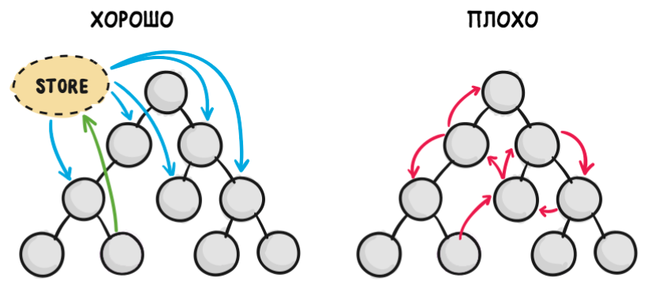

## MVC

**Model-View-Controller (MVC)** - это очень часто используемый шаблон проектирования программного обеспечения для реализации 
пользовательских интерфейсов.

Концепция MVC позволяет разделить данные (модель), представление и обработку действий (производимую контроллером) пользователя 
на три отдельных компонента:

- Модель (Model):
    - Предоставляет знания: данные и методы работы с этими данными;
    - Реагирует на запросы, изменяя своё состояние;
    - Не содержит информации, как эти знания можно визуализировать;
- Представление (View) — отвечает за отображение информации (визуализацию).
- Контроллер (Controller) — обеспечивает связь между пользователем и системой:
    - контролирует ввод данных пользователем и использует модель и представление для реализации необходимой реакции.

### React в роли View

*React.js* это библиотека для создания интерфейсов от Facebook. Все аспекты его использования мы рассматривать не будем, 
речь пойдет про Stateless-компоненты и React исключительно в роли View.  Это пример реализации слоя View на React:

```javascript
class FormAuthView extends React.Component {
   componentDidMount() {
      this.props.tryAutoFill();
   }
   render() {
      return (
         <div>
            <input type = "text" value = {this.props.login} onChange = {this.props.loginUpdate} />
	        <input type = "password" value = {this.props.password} onChange = {this.props.passwordUpdate}  />
            <button onClick = {this.props.submit}>
               Submit
            </button>
         </div>
      );   
   }
}
```

### Redux в роли Model

**Redux** является предсказуемым контейнером состояния для JavaScript-приложений. Он позволяет создавать приложения, которые 
ведут себя одинаково в различных окружениях (клиент, сервер и нативные приложения), а также просто тестируются.

Использование **Redux** подразумевает существование одного единственного объекта *Store*, в *State* которого будет хранится 
состояние всего вашего приложения, каждого его компонента.

Чтобы создать *Store*, в **Redux** есть функция *createStore*.

Синтаксис createStore(reducer, [preloadedState], [enhancer]);

Её единственный обязательный параметр это **Reducer**. **Reducer** это такая функция, которая принимает State и Action, 
и в соответствии с типом *Action* определенным образом модифицирует иммутабельный *State*, возвращая его измененную копию. 
Это единственное место в нашем приложении, где может меняться *State*.

### React-redux в роли Controller

Все React-компоненты так или иначе будут получать свой *State* и *Callback-и* для его изменения только через *Props*. 
При этом ни один React-компонент не будет знать о существовании *Redux и Actions* вообще, и ни один *Reducer* или *ActionCreator* 
не будет знать о React-компонентах. Данные и логика их обработки полностью отделены от их представления.

Никаких "Умных" компонентов не будет.

### Что нам дает такой подход

- Использование только Stateless-компонентов. Большую часть которых можно написать в виде Functional-component, что является 
рекомендованным подходом, т.к. они быстрее всего работают и потребляют меньше всего памяти
- React-компоненты можно переиспользовать с разными контроллерами или без них
- Легко писать тесты, ведь логика и отображение не связаны между собой
- Можно реализовать Undo/Redo и использовать Time Travel из Redux-DevTools
- Не нужно использовать Refs
- Жесткие правила при разработке делают код React-компонентов однообразным
- Отсутствуют проблемы с серверным рендерингом

### Что будет, если отступить от MVC?

Велик соблазн сделать какие-то компоненты поудобнее и написать их код побыстрее, завести внутри компонента State. Мол какие-то 
его данные временные, и хранить их не нужно. И всё это будет работать до поры до времени, пока, например, вам не придется 
реализовать логику с переходом на другой URL и возвращением обратно — тут всё сломается, временные данные окажутся не временными, 
и придется всё переписывать. При использовании Stateful-компонентов, чтобы достать их State, придется использовать Refs. 
Такой подход нарушает однонаправленность потока данных в приложении и повышает связность компонентов между собой. И то и 
другое — плохо.



### Заключение

Если есть возможность в полной мере использовать концепцию **MVC**, то давайте её использовать, и не нужно изобретать что-то 
другое. Это подход проверенный на прочность десятилетиями, и все его плюсы, минусы и подводные камни давно известны. Придумать 
что-то лучше навряд ли получится.

## Redux

### Зачем?

Вы могли заметить, что **React** не предоставляет (но и не навязывает) способов работы со слоем данных и/или бэкэндом на фронте. 
Поток данных в JSX через *props* не подходит для этого, так как одна и та же информация с бэка (например о текущем залогиненном 
пользователе) может применяться в отображении во множестве компонентов разных размеров и глубины вложенности. Попытки передать 
такую информацию через *props* из главного компонента *App* привели бы к сильному загрязнению кода JSX всякими *props* с данными 
и множественной копипасте.

### Компоненты и хранилище.

Попытки напрямую общаться между компонентами (например через колбэки или методы) приводят к спагетти-коду, так как "связей" в 
коде оказывается слишком много, и эта паутина сложно отлаживается и поддерживается в дальнейшем. Таким образом, нужен механизм 
общего хранилища информации о состоянии всего приложения, общедоступный для любого из компонентов, в независимости от его размера 
и глубины вложенности. При наличии подобной общей точки для обмена данными между бэком и компонентами (и компонентами между собой) 
количество связей между частями приложения меньше чем при прямом обращении компонент-компонент.

**Связи** при наличии хранилища предполагают разделение ответственности:
- Новые данные посылаются в хранилище потому что так надо; компонент, посылающий такое событие не волнует, как именно это 
изменение будет обработано.
- Хранилище знает, как правильно обработать новые данные; Хранилищу не важно, откуда эти данные пришли, и куда уйдут;
- Все компоненты, которые подписаны на этот вид данных, занимаются отображением и/или изменением логики своей работы, не 
заморачиваясь с тем, откуда этот сигнал пришел.

### Как?

- Само хранилище реализуется объектом, запрещенным к изменению напрямую;
- Запрос на изменение хранилища присылается в форме объекта (action), который обрабатывается специальной функцией-редьюсером.
- Редьюсер создает новый объект хранилища и возвращает его.
- Хранилище обновляется и оповещает подписчиков.

Итого: минимальная реализация redux занимает строк 50.

Для связывания компонентов с redux используется подход HOC - high-order components, аналог функций высшего порядка, только 
для компонентов. Суть в том, что на базе вашего компонента создается компонент-обертка, которая передает в ваш компонент нужные 
части хранилища и функции для изменения хранилища используя props. Таким образом компонент автоматически отображает изменения в 
хранилище и имеет возможность послать запрос на изменение в хранилище.

**Redux Basic**
```javascript
import {Provider, connect}   from 'react-redux';
import {createStore, combineReducers} from 'redux';

let store = createStore((state, action) => { //единственный редьюсер данного хранилища
    if (state === undefined){ //redux запускает редьюсер хотя бы раз, что бы инициализировать хранилище
        return {counter: 0};  //обязательно вернуть новый объект, а не изменить текущий state
    }
    if (action.type === 'COUNTER_INC'){ //в каждом action должен быть type
        return {counter: state.counter +1} //создаем новый объект базируясь на данных из предыдущего состояния
    }
    if (action.type === 'COUNTER_DEC'){
        return {counter: state.counter -1}
    }
    return state; //редьюсеров может быть несколько, в таком случае вызываются все редьюсеры, но далеко не всегда action.type будет относится к этому редьюсеру. Тогда редьюсер должен вернуть state как есть. 
})

store.dispatch({
    type: 'COUNTER_INC'
})

store.dispatch({
    type: 'COUNTER_DEC'
})
```

- createStore создаёт новое хранилище. В качестве параметра передается одна функция-редьюсер, которая обрабатывает все запросы 
на изменение хранилища
- Редьюсер принимает текущее состояние хранилища и объект action - действие над хранилищем.
- Когда запускается createStore редьюсер запускается с state = undefined для первоначальной инициализации хранилища
- В action обязательно должно быть поле type
- Редьюсер обязан возвращать каждый раз новый объект, а не модифицировать старый.
- Если редьюсер не знает переданный тип действия, он должен вернуть state как есть.
- метод dispatch посылает объект-действие в хранилище для обработки редьюсером

**Redux usual**

В обычной ситуации один редьюсер с большим количеством действий смотрится не очень. Посему в комплекте с redux идет функция 
combineReducers, которая:

- Воспринимает не один редьюсер (как createStore), а объект, ключами в котором являются ветви хранилища, а значениями - редьюсеры, 
работающие с этой ветвью.
- Редьюсеры получают не весь state, а только свою ветвь.
- Редьюсер возвращает не весь state, а только свою ветвь.
- Однако редьюсеры получают все действия: и свои, и чужие. Посему не забываем возвращать state неизменным если действие не 
относится к этому редьюсеру.

```javascript
const reducers = combineReducers({ 
    c: counterReducer,
    b: booleanReducer
}) //создаем функцию-обертку, которая запустит последовательно counterReducer и booleanReducer передав им ветви c и b хранилища 
// и обновив эти же ветви в случае нового состояния.
```

### actionCreators

По феншую вы не отправляете объект действия непосредственно литеральным параметром dispatch, а создаете функцию, которая на 
базе нужной информации возвращает объект действия. Это удобно при работе с компонентами React.

```javascript
function actionInc(){
    return {
        type: 'COUNTER_INC'
    }
}


function actionDec(){
    return {
        type: 'COUNTER_DEC'
    }
}

store.dispatch(actionInc())
store.dispatch(actionDec())
```

### React-Redux

Компоненты связываются с redux гибким способом:

- Все компоненты, которые вы хотите присоединить к тому или иному хранилищу должны находится внутри <Provider store = { someStore } />. 
Таким образом вы можете переподключить все вложенные компоненты к другому хранилищу в одном месте. Хотя обычно предполагается что 
хранилище одно на приложение.
- При создании компонента-обертки, связанного с redux вы можете указать какие части хранилища подключить к каким props; а так 
же передать через props набор функций, создающих действия (actionCreator), для отправки данных из компонента в хранилище.

```javascript
class Counter extends Component{
    render(){
        return (
            <div>
                <button onClick={this.props.actionInc}>+</button>
                <span>{this.props.counter}</span>
                <button onClick={this.props.actionDec}>-</button>
            </div>
        );
    }
}

let mapStateToProps = state => ({counter: state.c.counter}) //функция должна из state достать нужное значение, которое 
// попадет в props
let mapDispatchToProps = {actionInc, actionDec};     //actionCreator-ы, тут переданные, автоматом оборачиваются в dispatch

let ConnectedCounter = connect(mapStateToProps,mapDispatchToProps)(Counter) //connect возвращает функцию, которая из любого 
// компонента сделает компонент с props из mapStateToProps и mapDispatchToProps

let ConnectedViewCounter = connect(mapStateToProps)(props => <div>{props.counter}</div>)
```

Компонент Counter из примера выше готов принять через props 3 параметра - функции для увеличения и уменьшения счетчика, и само 
значение счетчика. 
Используя connect можно получить компонент-обертку (тут этот класс хранится в переменной ConnectedCounter), который будет использовать 
ваш компонент, но передавать ему нужные данные из store и обеспечивать возможностью отправить данные в store.

### connect

- Первый параметр - функция, которая собирает нужную информацию из хранилища (в функцию передается текущее состояние хранилища) 
и возвращает объект с ключами, которые вам нужны в props.
- Второй параметр - объект, в котором ключами будут опять же свойства в props, а значениями - actionCreator-ы. connect автоматически 
обернет ваши actionCreator в dispatch, после чего можно спокойно вызывать this.props.actionName() - это вызовет store.dispatch(actionName())

**connect возвращает функцию, которая из любого компонента сделает компонент-обертку с вышеуказанными настройками.**

На самом деле connect более всеяден в плане параметров, но вы всегда можете это загуглить.
