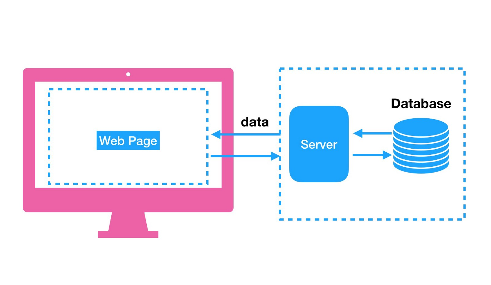
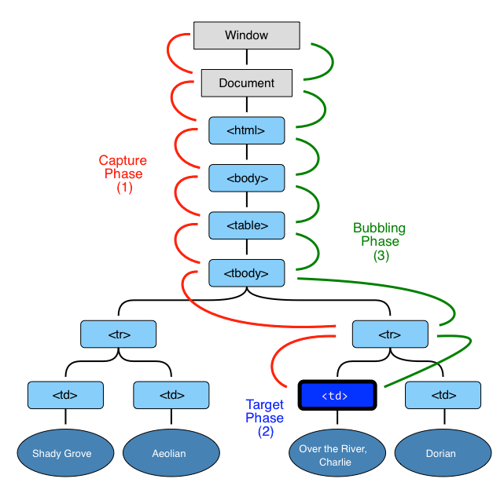
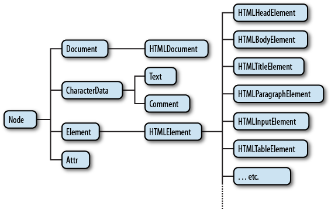

## Web Application

JS на фронте выступает для разработки веб приложений

#### Клиент - браузер

User Interface - HTML, CSS
Взаимодействие пользователя c UI - JavaScript

#### HTML - HyperText Markup Language

- DOCTYPE - Document Type Definition
- Tags (\
\
, \<form>\</form>, \<input>)
- Head
- Body

#### Scripts

Script tag \

Скрипты могут быть:
- inline script (пишем код непосредственно в html)
- external script (подключаем файл с кодом)

Скрипты можно вставить в:

- head
- body
- end of body

#### Основные задачи при работе в браузере

- Взаимодействие пользователя с html элементами (нажатие на кнопки, ввод в инпуты)
- Работа с изображениями
- Анимации
- Валидация форм
- Взаимодействие с сервером

## Event Loop

## Document, DOM

DOM - document object model

DOM - это представление документа в виде дерева объектов, доступное для изменения через Javascript

Он имеет древовидную структуру

## Events

События проходят две стадии

- Стадия захвата
- Стадия таргета
- Стадия всплытия

Отмена событий:

- event.stopPropagation() отмена всплытия
- event.preventDefault() отмена действия по умолчанию

## DOM manipulation

### Иерархия классов

### Основные классы

- Document
- Element
- Text

### Аттрибуты

- Стандартные
- Дата атрибуты (data attributes)
- Невалидные

### Материалы для прочтения 

- Events https://learn.javascript.ru/events   https://developer.mozilla.org/ru/docs/Web/Events
- Event loops https://developer.mozilla.org/ru/docs/Web/JavaScript/EventLoop